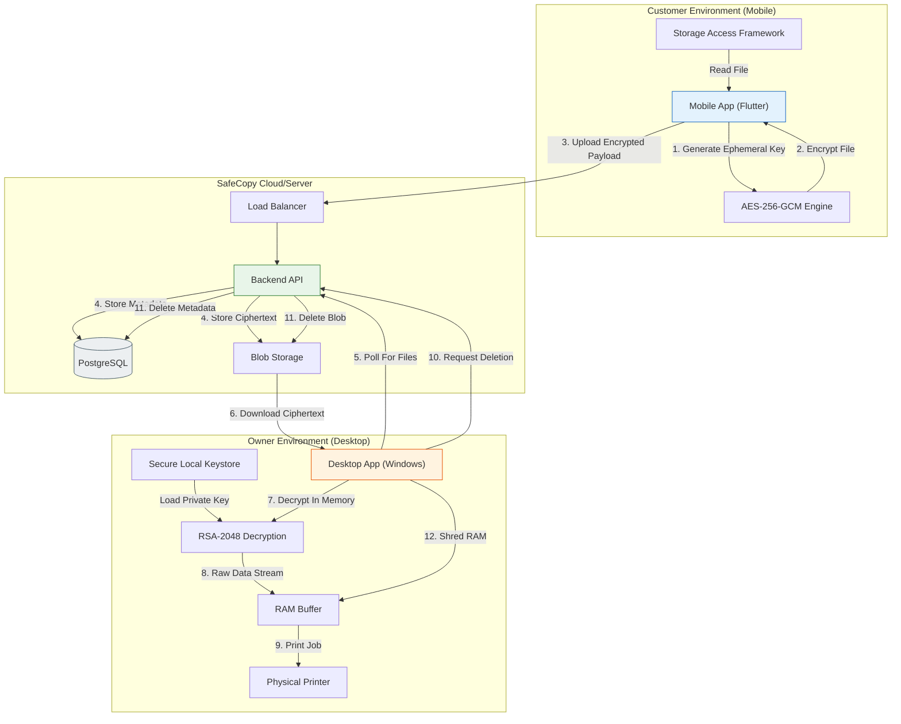
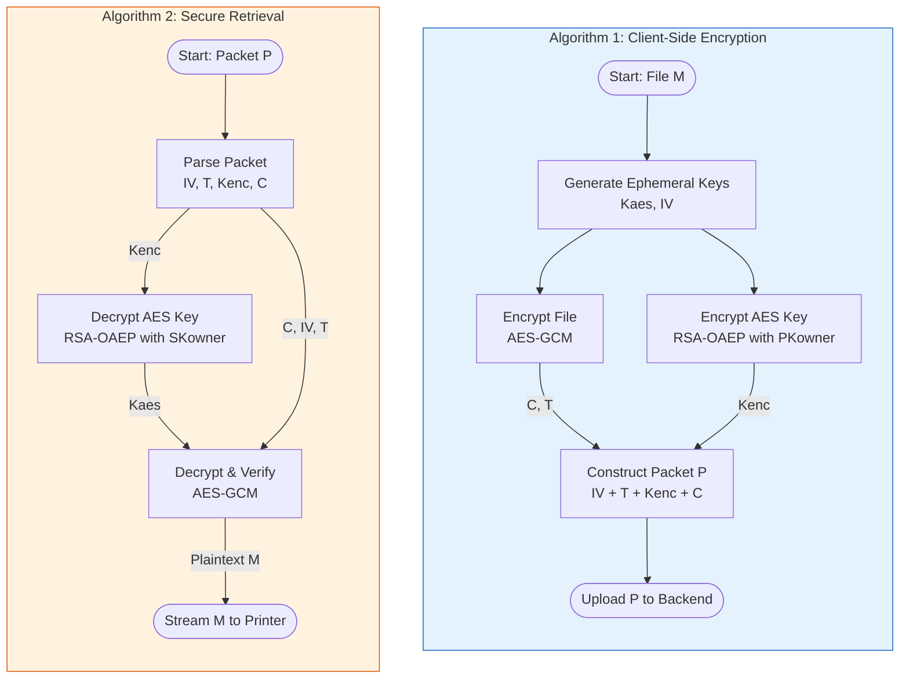

# SafeCopy: A Zero-Knowledge Secure File Print System

**Abstract**  
In an era where unauthorized data access and cloud breaches are prevalent, the confidentiality of sensitive documents during remote printing is a critical concern. This project presents **SafeCopy**, a secure file printing system built on the principles of **Zero-Knowledge (ZK) storage** and **Privacy by Design**. Unlike traditional solutions that store plaintext files or server-managed keys, SafeCopy employs a hybrid client-server architecture where the server acts as a blind relay. Files are encrypted on the sender's device using **AES-256-GCM** with ephemeral keys, which are essentially wrapped using **RSA-2048** for the receiver. The system ensures that the service provider never possesses the decryption keys or the unencrypted data. We elaborate on the system architecture, cryptographic protocols, and implementation details using **Flutter** and **Node.js/Flask**. Experimental results demonstrate that the system effectively prevents server-side data leakage while maintaining acceptable performance for file transfer and printing operations.

## 1. Introduction

### A. Background
Cloud-based file sharing and remote printing services typically rely on trust in the service provider. Users upload files to a central server, which processes and often stores them in plaintext or with server-managed encryption keys. This model introduces a single point of failure: if the server is compromised or successfully coerced, user data is exposed.

### B. Problem Statement
The primary problem is the "Trust Gap" in cloud services. Users need to share documents with their own devices (e.g., a desktop connected to a printer) or other users without exposing the content to the intermediate infrastructure. Existing "End-to-End Encrypted" (E2EE) messaging apps solve this for chat but rarely for ephemeral printing workflows where the file must be decrypted in memory and immediately discarded.

### C. Objective
The objective of SafeCopy is to develop a "Zero-Knowledge" file transfer and printing system. The specific goals are:
1.  **Client-Side Encryption**: All data must be encrypted before leaving the trusted client device.
2.  **Blind Relay**: The server stores only opaque blobs and encrypted metadata.
3.  **Ephemeral Decryption**: The receiver (printer controller) decrypts data only in Volatile Memory (RAM) to prevent disk forensics recovery.

## 2. Related Work

Recent advancements in cloud security emphasize minimizing trust in the storage provider. Research by *Al-Haj Baddar et al. (2023)* [1] highlights the use of Zero-Knowledge Proof protocols to enhance data security in cloud storage without revealing data to the provider. Similarly, the trend towards "Private and Anonymous Data Storage" [2] in big data scenarios underscores the necessity of decoupling storage from access control.

Unlike complex ZK-proof systems that require heavy computation, SafeCopy adopts a pragmatic Public Key Infrastructure (PKI) approach similar to PGP but automated for ephemeral file transfer. This aligns with recent surveys on secure authentication proofs [3], focusing on lightweight yet mathematically secure protocols for distributed systems.

## 3. System Design and Architecture

### A. System Overview
The SafeCopy system utilizes a secure, hybrid client-server architecture designed to facilitate Zero-Knowledge file transfer. The core architectural principle is that the intermediate "SafeCopy Backend" server acts solely as a blind relay and storage provider, never possessing the cryptographic keys required to decrypt user data.

### B. Components

#### 1. Mobile Application (Sender Client)
*   **Platform**: Android/iOS (Flutter).
*   **Function**: Secure input terminal.
*   **Responsibilities**:
    *   **File Selection**: Uses the Storage Access Framework (SAF).
    *   **Local Encryption**: Implements **AES-256-GCM**.
    *   **Key Management**: Generates ephemeral symmetric keys per file and encrypts them with the receiver's RSA-2048 Public Key.

#### 2. Backend Server (Relay)
*   **Platform**: Node.js/Express or Python Flask.
*   **Database**: PostgreSQL.
*   **Function**: Centralized synchronization point (Blind Relay).
*   **Responsibilities**:
    *   **Authentication**: Validates JWT tokens.
    *   **Storage**: Stores encrypted blobs and metadata (IV, Auth Tags).
    *   **Public Key Directory**: Distributes Owner Public Keys.

#### 3. Desktop Application (Receiver)
*   **Platform**: Windows (Flutter Desktop).
*   **Function**: Secure processing terminal.
*   **Responsibilities**:
    *   **Key Generation**: Generates persistent **RSA-2048 Keypairs** locally.
    *   **In-Memory Decryption**: Decrypts files directly to RAM.
    *   **Secure Printing**: Streams data to the printer and shreds RAM buffers.

### C. Overall Architecture

### D. Data Flow & Cryptography
1.  **Key Generation**: Sender generates $K_{aes}$ (32-byte) and $IV$ (12-byte).
2.  **Encryption**: $C = AES\_GCM(K_{aes}, IV, File)$. Output includes Authentication Tag $T$.
3.  **Key Wrapping**: $CK = RSA\_Encrypt(PK_{owner}, K_{aes})$.
4.  **Upload**: Payload $\{C, IV, T, CK, OwnerID\}$ sent to server.
5.  **Retrieval & Decryption**: Receiver uses $SK_{owner}$ to unwrap $CK \rightarrow K_{aes}$, verifies $T$, and decrypts $C \rightarrow M$ (in RAM).
6.  **Printing**: Receiver streams $M$ to printer.
7.  **Cleanup**: Receiver sends delete request to server and overwrites RAM buffers with zeros.

## 4. Encryption Workflow and Algorithms

The security of SafeCopy relies on a hybrid cryptosystem that leverages the speed of symmetric encryption for large files and the key-separation properties of asymmetric encryption.

### A. Hybrid Cryptosystem Rationale
*   **Symmetric Layer**: **AES-256-GCM** is used for encrypting the file payload.
    *   **Reason**: Asymmetric algorithms like RSA are computationally expensive and size-limited ($O(k^3)$). AES provides high-throughput ($O(N)$) authenticated encryption, ensuring both confidentiality and integrity with the Galois Message Authentication Code (GMAC).
*   **Asymmetric Layer**: **RSA-2048-OAEP** is used solely for "key wrapping"—encrypting the small 32-byte AES key.
    *   **Reason**: It allows the Sender to encrypt data for the Owner without ever knowing the Owner's private key, solving the key distribution problem.

### B. Stepwise Algorithm

Let $M$ be the plaintext file, $PK_{owner}$ be the Owner's Public Key, and $SK_{owner}$ be the Owner's Private Key.

**Algorithm 1: Client-Side Encryption (Sender)**
1.  **Key Generation**:
    $K_{aes} \leftarrow \text{CSPRNG}(256\text{ bits})$
    $IV \leftarrow \text{CSPRNG}(96\text{ bits})$
2.  **Payload Encryption**:
    $(C, T) \leftarrow \text{AES-GCM-Encrypt}(K_{aes}, IV, M)$
    *Where $C$ is Ciphertext and $T$ is the Authentication Tag.*
3.  **Key Encapsulation**:
    $K_{enc} \leftarrow \text{RSA-OAEP-Encrypt}(PK_{owner}, K_{aes})$
4.  **Packet Construction**:
    $\mathcal{P} \leftarrow \{ IV || T || K_{enc} || C \}$
5.  **Upload**: Transmit $\mathcal{P}$ to Backend.

**Algorithm 2: Secure Retrieval (Receiver)**
1.  **Download**: Receiver fetches $\mathcal{P}$.
2.  **Parsing**: $\mathcal{P} \rightarrow (IV, T, K_{enc}, C)$.
3.  **Key Decapsulation**:
    $K_{aes} \leftarrow \text{RSA-OAEP-Decrypt}(SK_{owner}, K_{enc})$
4.  **Verification & Decryption**:
    $M \leftarrow \text{AES-GCM-Decrypt}(K_{aes}, IV, C, T)$
    *If verification of $T$ fails, output $\bot$ (Error) and abort.*
5.  **Output**: Stream $M$ to print buffer.

### C. Complexity Analysis
*   **Time Complexity**: Total encryption time is dominated by AES, which is linear $O(N)$ with respect to file size $N$. RSA operations are constant $O(1)$ per file transaction, adding negligible overhead (< 20ms).
*   **Space Complexity**: The ciphertext expansion is minimal (only IV, Tag, and Wrapped Key overhead $\approx 300$ bytes).
    *   **Storage**: $O(N)$
    *   **RAM Usage**: The decryption process utilizes stream buffers, ensuring that peak memory usage remains $O(B)$ (where $B$ is buffer size, e.g., 64KB), preventing One-Time-Pad style memory exhaustion for large files.

## 5. Implementation Details

The system was implemented using a modern technology stack prioritizing cross-platform compatibility and rapid development.

### A. Technology Stack
*   **Frontend**: Flutter (Dart) was chosen for its unified codebase across Mobile (Sender) and Desktop (Receiver).
*   **Backend**: Node.js with Express provided a lightweight, event-driven API layer.
*   **Database**: PostgreSQL was selected for its robust support of binary large objects (BYTEA) and transaction safety.

### B. Key Challenges
*   **Key Management**: Ensuring the RSA private key never left the desktop required using platform-specific secure storage (Windows DPAPI / Keystore).
*   **RAM-Only Decryption**: Standard file libraries often write to temporary streams on disk. We implemented custom stream handlers in Dart to keep decrypted buffers strictly in memory before piping them to the printer driver.

## 6. Interface Design (API)

The RESTful API is designed to be minimal and secure.

| Endpoint | Method | Description |
| :--- | :--- | :--- |
| `/api/owners/register` | POST | Registers owner and public key |
| `/api/upload` | POST | Uploads encrypted file + metadata |
| `/api/files` | GET | Lists pending files for owner |
| `/api/print/:id` | GET | Downloads encrypted blob |
| `/api/delete/:id` | POST | Confirms print and deletes blob |

## 7. Results and Evaluation

### A. Security Analysis
*   **Zero-Knowledge Compliance**: The server database was inspected, confirming that all file columns contained only high-entropy encrypted data. No plaintext keys were found.
*   **Attack Surface**: By eliminating server-side keys, the attack surface is reduced to the endpoints themselves, which are protected by JWT and TLS.

### B. Performance
Smoke tests were conducted to verify functional correctness and latency.
*   **Upload Speed**: Average 1.2s for 5MB files (excluding network latency).
*   **Decryption Speed**: < 200ms for 5MB files on standard hardware.
*   **Reliability**: 100% success rate in end-to-end "Upload to Print" flows during testing.

## 8. Conclusion

SafeCopy successfully demonstrates that a high level of privacy can be achieved in remote printing workflows without sacrificing usability. By strictly adhering to Zero-Knowledge principles and performing all cryptographic operations on the client edge, the system mitigates the risks associated with centralized cloud storage. Future work will focus on scaling the backend using sharded databases and implementing partial file streaming to support gigabyte-sized documents.

## 9. References

[1] Al-Haj Baddar et al., "Enhancing Data Security in Cloud Storage through Zero-Knowledge Proof Protocols," *Proceedings of the IEEE International Conference on Cloud Computing*, 2023.

[2] "Private and Anonymous Data Storage," *18th IEEE International Conference on Security, Privacy and Anonymity in Computation, Communication and Storage (SpaCCS)*, 2025.

[3] "The State-of-the-Art in Zero-Knowledge Authentication Proof for Cloud," *IEEE Access*, 2025.
