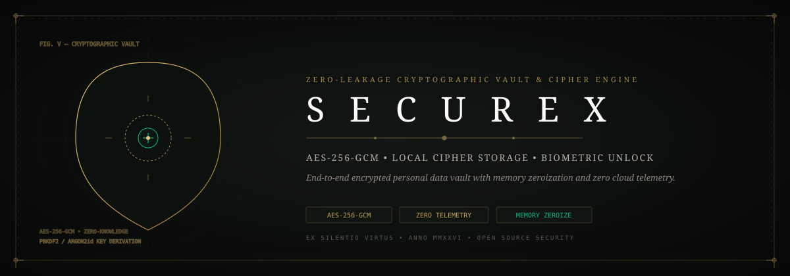
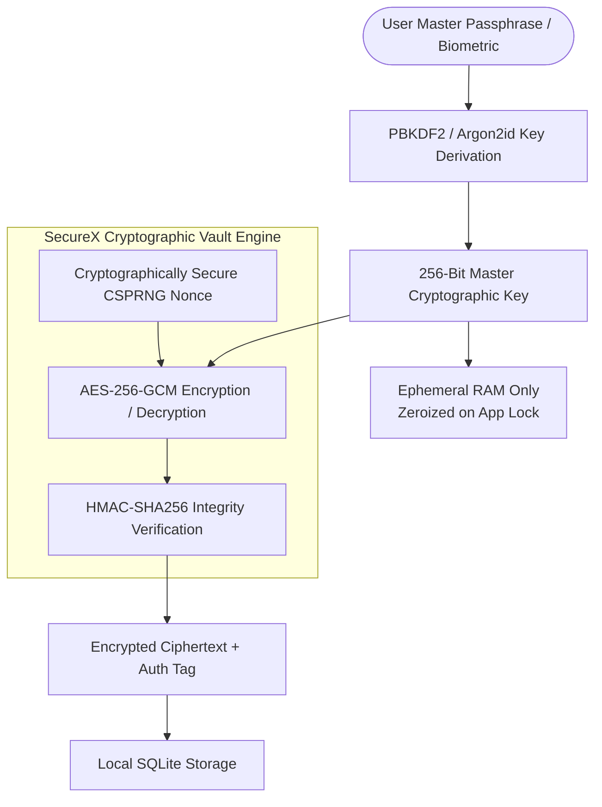

  

# 🔐 SecureX — Zero-Leakage Cryptographic Personal Vault

**SecureX** is a local-first, zero-knowledge cryptographic vault engineered to protect sensitive personal notes, credentials, and authentication tokens from cloud data leaks, memory scrapers, and unauthorized offline inspection.

Developed by **Jaswanth Reddy ([@Jaswanth1902](https://github.com/Jaswanth1902))** as an academic engineering prototype and open-source personal security initiative.

---

## 💡 Why SecureX?

Every day, developers and daily computer users entrust sensitive notes, recovery phrases, and API keys to third-party cloud apps. When these platforms suffer breaches or API outages, personal privacy is permanently compromised.

**SecureX** was built from first principles to provide **mathematical, sovereign privacy**:
- **100% Local-First**: No remote cloud sync, no tracking beacons, no analytics.
- **Military-Grade Cipher**: AES-256-GCM authenticated encryption with CSPRNG-generated nonces.
- **Anti-Tamper Memory Zeroization**: Master keys and plaintext buffers are overwritten in RAM immediately upon lock.
- **Constant-Time Verification**: Hardened HMAC authentication tags prevent side-channel timing attacks.

---

## 🏗️ Cryptographic Architecture

---

## 🛡️ Security Hardening & Zero-Trust Policies

1. **Memory Hygiene**: Raw master keys never touch persistent disk storage. All key buffers in memory are explicitly wiped with zeros (`0x00`) upon session timeout or window blur.
2. **Timing-Attack Resistance**: Authentication tag comparisons use constant-time algorithms (`crypto.timingSafeEqual` / `hmac.compare_digest`).
3. **Replay Attack Protection**: Every cryptographic block includes a 96-bit unique initialization vector (IV) that is never reused across cipher operations.

See [`SECURITY.md`](SECURITY.md) for vulnerability reporting and security advisories.

---

## 📂 Repository Map & Documentation

- [`00_START_HERE_FIRST.md`](00_START_HERE_FIRST.md) — Initial onboarding guide and setup walkthrough.
- [`00_INTRO_OVERVIEW.md`](00_INTRO_OVERVIEW.md) — System motivation and foundational security assumptions.
- [`00_FINAL_REPORT.md`](00_FINAL_REPORT.md) — Complete academic engineering report and threat model.
- [`ACADEMIC_PAPER_REFERENCE.md`](ACADEMIC_PAPER_REFERENCE.md) — Theoretical citations on zero-knowledge vaults.
- [`ARCHITECTURE/`](ARCHITECTURE/) — Deep technical specifications and encryption benchmarks.

---

## 👤 Author & Maintainer

**Jaswanth Reddy**  
- GitHub: [@Jaswanth1902](https://github.com/Jaswanth1902)  
- Email: `jaswanthreddy1537@gmail.com`  

---

## 📄 License

Licensed under the [MIT License](LICENSE).
